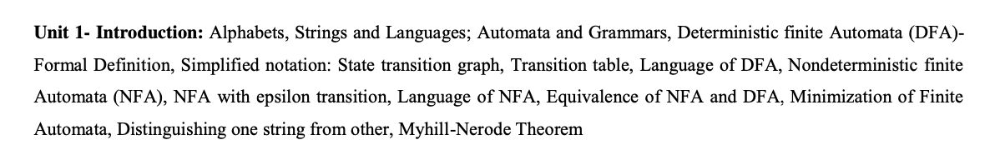

# Theory of Computation (TOC) Handwritten Notes

Welcome to the Theory of Computation (TOC) Handwritten Notes repository! Here you will find easy-to-understand notes on various units of TOC. These notes are intended to serve as a helpful resource for students and enthusiasts interested in learning the fundamentals of TOC.

**This repository is a work in progress**, and notes for different units will be uploaded gradually. Feel free to use these notes for your studies, projects, or teaching purposes. However, please provide proper credits if you use this content.

## Table of Contents

**_Units_**

- **Unit 1: Introduction to Automata Theory:** ***[Notes](https://github.com/adisharma-git/TOC-HANDWRITTEN-NOTES/tree/main/UNIT-I)***
  
- **Unit 2: Regular Expressions:**
  > Notes will be uploaded soon.
- **Unit 3: Context-free languages and pushdown automata:**
  > Notes will be uploaded soon.
- **Unit 4: Context-sensitive languages:**
  > Notes will be uploaded soon.
- **Unit 5: Types of Turing machine:**
  > Notes will be uploaded soon.

## Usage

Feel free to browse through the notes for each unit by clicking on the respective links above. You can use these notes for self-study, reference, or teaching purposes. If you find any errors or have suggestions for improvements, please consider contributing.

## Contributing

Contributions to improve the quality and coverage of these notes are welcome! If you have additional content, corrections, or enhancements, please follow these steps:

- Fork the repository.
- Create a new branch `git checkout -b feature/add-notes`.
- Make your changes.
- Commit your changes `git commit -am 'Add new notes'`.
- Push to the branch `git push origin feature/add-notes`.
- Create a new Pull Request.

## Credits

If you use these notes in your projects, studies, or presentations, please provide proper credits to this repository. You can credit it as:

**Handwritten Theory of Computation (TOC) Notes by ADITYA SAHRMA - https://github.com/adisharma-git/TOC-HANDWRITTEN-NOTES**

## Contact

For any questions, doubts, feedback, or collaboration opportunities, please feel free to reach out to me via email at :  tech.adishar@gmail.com
